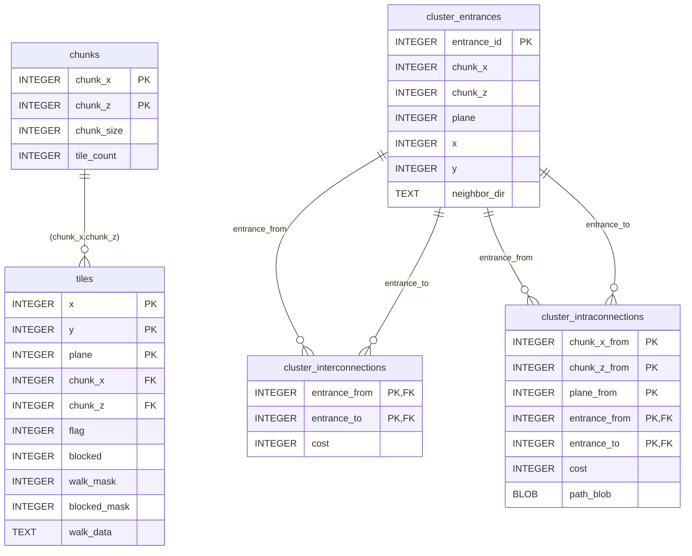

# worldReachableTiles.db – Schema Documentation

- **Path**: `/home/query/Dev/rs3cache_extractor/worldReachableTiles.db`
- **Engine**: SQLite
- **Encoding**: UTF-8
- **PRAGMA foreign_keys**: 0 (disabled)
- **PRAGMA user_version**: 0
- **PRAGMA application_id**: 0

> Note: With `foreign_keys` disabled, SQLite does not enforce declared foreign key constraints at runtime.

## Overview
- **Tables (17)**: `abstract_teleport_edges`, `chunks`, `cluster_entrances`, `cluster_interconnections`, `cluster_intraconnections`, `jps_jump`, `jps_spans`, `meta`, `movement_policy`, `teleports_door_nodes`, `teleports_ifslot_nodes`, `teleports_item_nodes`, `teleports_lodestone_nodes`, `teleports_npc_nodes`, `teleports_object_nodes`, `teleports_requirements`, `tiles`
- **Views (1)**: `teleports_all`
- **Triggers**: none detected
- **Indexes**: indexes created implicitly by PRIMARY KEY and UNIQUE constraints (no standalone index DDL captured)

## Entity-Relationship (ER) diagram


> Relationships shown reflect explicit FOREIGN KEYs present in DDL. Other logical relationships (e.g., `abstract_teleport_edges.requirement_id` to `teleports_requirements.id`) are not enforced by FKs in the schema.

## Tables

### `abstract_teleport_edges`
- **Purpose**: Abstracted edges representing teleports between two tiles.
- **Primary key**: `edge_id`
- **Foreign keys**: none declared
- **DDL**:
```sql
CREATE TABLE abstract_teleport_edges (
  edge_id       INTEGER PRIMARY KEY,
  src_x         INTEGER NOT NULL,
  src_y         INTEGER NOT NULL,
  src_plane     INTEGER NOT NULL,
  dst_x         INTEGER NOT NULL,
  dst_y         INTEGER NOT NULL,
  dst_plane     INTEGER NOT NULL,
  cost          INTEGER NOT NULL,
  requirement_id INTEGER,
  src_entrance  INTEGER,
  dst_entrance  INTEGER
);
```

### `chunks`
- **Primary key**: `(chunk_x, chunk_z)`
- **DDL**:
```sql
CREATE TABLE chunks (
  chunk_x INTEGER,
  chunk_z INTEGER,
  chunk_size INTEGER,
  tile_count INTEGER,
  PRIMARY KEY (chunk_x, chunk_z)
);
```

### `cluster_entrances`
- **Primary key**: `entrance_id`
- **Unique constraints**: `UNIQUE(chunk_x, chunk_z, plane, x, y)`
- **DDL**:
```sql
CREATE TABLE cluster_entrances (
  entrance_id   INTEGER PRIMARY KEY,
  chunk_x       INTEGER NOT NULL,
  chunk_z       INTEGER NOT NULL,
  plane         INTEGER NOT NULL,
  x             INTEGER NOT NULL,
  y             INTEGER NOT NULL,
  neighbor_dir  TEXT NOT NULL CHECK (neighbor_dir IN ('N','S','E','W')),
  UNIQUE (chunk_x, chunk_z, plane, x, y)
);
```

### `cluster_interconnections`
- **Primary key**: `(entrance_from, entrance_to)`
- **Foreign keys**:
  - `entrance_from` → `cluster_entrances(entrance_id)`
  - `entrance_to` → `cluster_entrances(entrance_id)`
- **DDL**:
```sql
CREATE TABLE cluster_interconnections (
  entrance_from INTEGER NOT NULL,
  entrance_to   INTEGER NOT NULL,
  cost          INTEGER NOT NULL,
  PRIMARY KEY (entrance_from, entrance_to),
  FOREIGN KEY (entrance_from) REFERENCES cluster_entrances(entrance_id),
  FOREIGN KEY (entrance_to)   REFERENCES cluster_entrances(entrance_id)
);
```

### `cluster_intraconnections`
- **Primary key**: `(chunk_x_from, chunk_z_from, plane_from, entrance_from, entrance_to)`
- **Foreign keys**:
  - `entrance_from` → `cluster_entrances(entrance_id)`
  - `entrance_to` → `cluster_entrances(entrance_id)`
- **DDL**:
```sql
CREATE TABLE cluster_intraconnections (
  chunk_x_from  INTEGER NOT NULL,
  chunk_z_from  INTEGER NOT NULL,
  plane_from    INTEGER NOT NULL,
  entrance_from INTEGER NOT NULL,
  entrance_to   INTEGER NOT NULL,
  cost          INTEGER NOT NULL,
  path_blob     BLOB,
  PRIMARY KEY (chunk_x_from, chunk_z_from, plane_from, entrance_from, entrance_to),
  FOREIGN KEY (entrance_from) REFERENCES cluster_entrances(entrance_id),
  FOREIGN KEY (entrance_to)   REFERENCES cluster_entrances(entrance_id)
);
```

### `jps_jump`
- **Primary key**: `(x, y, plane, dir)`
- **DDL**:
```sql
CREATE TABLE jps_jump (
  x INTEGER NOT NULL,
  y INTEGER NOT NULL,
  plane INTEGER NOT NULL,
  dir INTEGER NOT NULL,
  next_x INTEGER,
  next_y INTEGER,
  forced_mask INTEGER,
  PRIMARY KEY (x, y, plane, dir)
);
```

### `jps_spans`
- **Primary key**: `(x, y, plane)`
- **DDL**:
```sql
CREATE TABLE jps_spans (
  x INTEGER NOT NULL,
  y INTEGER NOT NULL,
  plane INTEGER NOT NULL,
  left_block_at INTEGER,
  right_block_at INTEGER,
  up_block_at INTEGER,
  down_block_at INTEGER,
  PRIMARY KEY (x, y, plane)
);
```

### `meta`
- **Primary key**: `key`
- **DDL**:
```sql
CREATE TABLE meta (
  key TEXT PRIMARY KEY,
  value TEXT NOT NULL
);
```

### `movement_policy`
- **Primary key**: `policy_id` with `CHECK (policy_id = 1)`
- **DDL**:
```sql
CREATE TABLE movement_policy (
  policy_id INTEGER PRIMARY KEY CHECK(policy_id = 1),
  allow_diagonals INTEGER NOT NULL,
  allow_corner_cut INTEGER NOT NULL,
  unit_radius_tiles INTEGER NOT NULL
);
```

### `teleports_door_nodes`
- **Primary key**: none declared
- **DDL**:
```sql
CREATE TABLE "teleports_door_nodes" (
  "id"    INTEGER,
  "direction"     REAL,
  "real_id_open"  INTEGER,
  "real_id_closed"        INTEGER,
  "location_open_x"       INTEGER,
  "location_open_y"       INTEGER,
  "location_open_plane"   INTEGER,
  "location_closed_x"     INTEGER,
  "location_closed_y"     INTEGER,
  "location_closed_plane" INTEGER,
  "tile_inside_x" INTEGER,
  "tile_inside_y" INTEGER,
  "tile_inside_plane"     INTEGER,
  "tile_outside_x"        INTEGER,
  "tile_outside_y"        INTEGER,
  "tile_outside_plane"    INTEGER,
  "open_action"   TEXT,
  "cost"  INTEGER,
  "next_node_type"        REAL,
  "next_node_id"  REAL,
  "requirement_id"        REAL
);
```

### `teleports_ifslot_nodes`
- **Primary key**: none declared
- **DDL**:
```sql
CREATE TABLE "teleports_ifslot_nodes" (
  "id"    INTEGER,
  "interface_id"  INTEGER,
  "component_id"  INTEGER,
  "slot_id"       INTEGER,
  "click_id"      INTEGER,
  "dest_min_x"    REAL,
  "dest_max_x"    REAL,
  "dest_min_y"    REAL,
  "dest_max_y"    REAL,
  "dest_plane"    REAL,
  "cost"  INTEGER,
  "next_node_type"        TEXT,
  "next_node_id"  REAL,
  "requirement_id"        REAL
);
```

### `teleports_item_nodes`
- **Primary key**: none declared
- **DDL**:
```sql
CREATE TABLE "teleports_item_nodes" (
  "id"    INTEGER,
  "item_id"       INTEGER,
  "action"        TEXT,
  "dest_min_x"    INTEGER,
  "dest_max_x"    INTEGER,
  "dest_min_y"    INTEGER,
  "dest_max_y"    INTEGER,
  "dest_plane"    INTEGER,
  "next_node_type"        REAL,
  "next_node_id"  REAL,
  "cost"  INTEGER,
  "requirement_id"        INTEGER
);
```

### `teleports_lodestone_nodes`
- **Primary key**: none declared
- **DDL**:
```sql
CREATE TABLE "teleports_lodestone_nodes" (
  "id"    INTEGER,
  "lodestone"     TEXT,
  "dest_x"        INTEGER,
  "dest_y"        INTEGER,
  "dest_plane"    INTEGER,
  "cost"  INTEGER,
  "next_node_type"        REAL,
  "next_node_id"  REAL,
  "requirement_id"        REAL
);
```

### `teleports_npc_nodes`
- **Primary key**: none declared
- **DDL**:
```sql
CREATE TABLE "teleports_npc_nodes" (
  "id"    INTEGER,
  "match_type"    TEXT,
  "npc_id"        INTEGER,
  "npc_name"      REAL,
  "action"        TEXT,
  "dest_min_x"    REAL,
  "dest_max_x"    REAL,
  "dest_min_y"    REAL,
  "dest_max_y"    REAL,
  "dest_plane"    INTEGER,
  "search_radius" INTEGER,
  "cost"  INTEGER,
  "orig_min_x"    REAL,
  "orig_max_x"    REAL,
  "orig_min_y"    REAL,
  "orig_max_y"    REAL,
  "orig_plane"    INTEGER,
  "next_node_type"        TEXT,
  "next_node_id"  INTEGER,
  "requirement_id"        INTEGER
);
```

### `teleports_object_nodes`
- **Primary key**: none declared
- **DDL**:
```sql
CREATE TABLE "teleports_object_nodes" (
  "id"    INTEGER,
  "match_type"    TEXT,
  "object_id"     REAL,
  "object_name"   TEXT,
  "action"        TEXT,
  "dest_min_x"    INTEGER,
  "dest_max_x"    INTEGER,
  "dest_min_y"    INTEGER,
  "dest_max_y"    INTEGER,
  "dest_plane"    INTEGER,
  "orig_min_x"    INTEGER,
  "orig_max_x"    INTEGER,
  "orig_min_y"    INTEGER,
  "orig_max_y"    INTEGER,
  "orig_plane"    INTEGER,
  "search_radius" INTEGER,
  "cost"  INTEGER,
  "next_node_type"        TEXT,
  "next_node_id"  REAL,
  "requirement_id"        REAL
);
```

### `teleports_requirements`
- **Primary key**: none declared
- **DDL**:
```sql
CREATE TABLE "teleports_requirements" (
  "id"    INTEGER,
  "metaInfo"      TEXT,
  "key"   TEXT,
  "value" REAL,
  "comparison"    TEXT
);
```

### `tiles`
- **Primary key**: `(x, y, plane)`
- **Foreign keys**:
  - `(chunk_x, chunk_z)` → `chunks(chunk_x, chunk_z)`
- **DDL**:
```sql
CREATE TABLE tiles (
  x INTEGER,
  y INTEGER,
  plane INTEGER,
  chunk_x INTEGER,
  chunk_z INTEGER,
  flag INTEGER,
  blocked INTEGER,
  walk_mask INTEGER,
  blocked_mask INTEGER,
  walk_data TEXT,
  FOREIGN KEY (chunk_x, chunk_z) REFERENCES chunks(chunk_x, chunk_z),
  PRIMARY KEY (x, y, plane)
);
```

## Views

### `teleports_all`
- **Purpose**: Unioned view normalizing teleport node tables into a common edge-like shape, exposing `kind`, `id`, `src_*`, `dst_*`, `cost`, `requirement_id`.
- **DDL**:
```sql
CREATE VIEW teleports_all AS
SELECT
  'door' AS kind, id,
  tile_outside_x AS src_x, tile_outside_y AS src_y, tile_outside_plane AS src_plane,
  tile_inside_x  AS dst_x,  tile_inside_y  AS dst_y,  tile_inside_plane  AS dst_plane,
  cost, requirement_id
FROM teleports_door_nodes
UNION ALL
SELECT 'lodestone', id, dest_x, dest_y, dest_plane, dest_x, dest_y, dest_plane, cost, requirement_id
FROM teleports_lodestone_nodes
UNION ALL
SELECT 'npc', id, orig_min_x, orig_min_y, orig_plane, dest_min_x, dest_min_y, dest_plane, cost, requirement_id
FROM teleports_npc_nodes
UNION ALL
SELECT 'object', id, orig_min_x, orig_min_y, orig_plane, dest_min_x, dest_min_y, dest_plane, cost, requirement_id
FROM teleports_object_nodes
UNION ALL
SELECT 'item', id, dest_min_x, dest_min_y, dest_plane, dest_min_x, dest_min_y, dest_plane, cost, requirement_id
FROM teleports_item_nodes;
```

## Notes and recommendations
- **Foreign key enforcement**: Consider enabling `PRAGMA foreign_keys = ON;` at connection time if consistency enforcement is desired.
- **Indexes**: Evaluate adding indexes for frequent lookup patterns (e.g., `tiles(chunk_x, chunk_z)`, `abstract_teleport_edges(requirement_id)`, `teleports_*_nodes(id)`) if query performance indicates a need. Primary keys and the unique constraint already create backing indexes.
- **Data model hygiene**: Several `teleports_*` tables lack explicit primary keys; if `id` is unique, consider declaring `PRIMARY KEY(id)` and normalizing numeric vs textual types for `next_node_type`.
