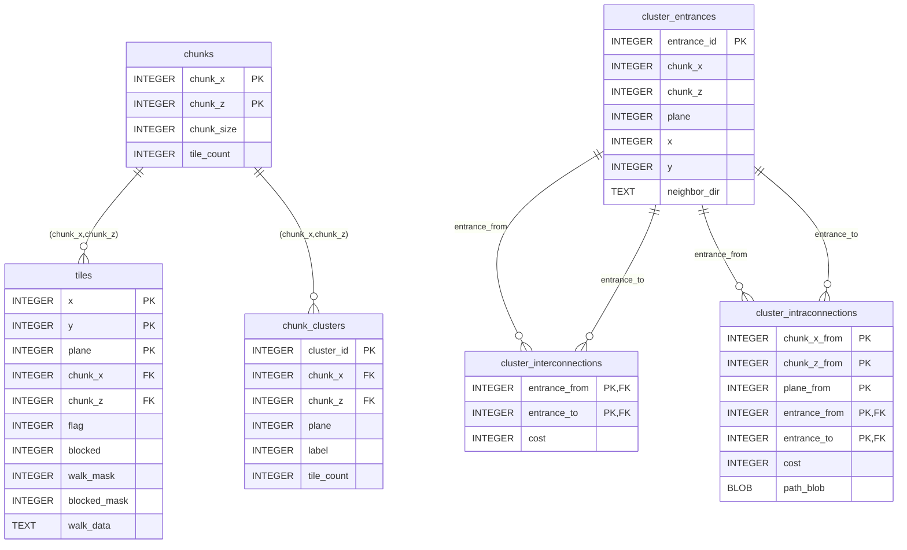

# worldReachableTiles.db – Schema Documentation

- **Path**: `/home/query/Dev/rs3cache_extractor/worldReachableTiles.db`
- **Engine**: SQLite
- **Encoding**: UTF-8
- **PRAGMA foreign_keys**: 0 (disabled)
- **PRAGMA user_version**: 0
- **PRAGMA application_id**: 0

> Note: With `foreign_keys` disabled, SQLite does not enforce declared foreign key constraints at runtime.

## Context

The `worldReachableTiles.db` database defines the tile connectivity, teleports, and pathfinding metadata extracted from RuneScape 3’s game cache. It supports world graph traversal, cluster mapping, and teleportation logic used by external pathfinding utilities.

## Overview
- **Tables (18)**: `abstract_teleport_edges`, `chunks`, `chunk_clusters`, `cluster_entrances`, `cluster_interconnections`, `cluster_intraconnections`, `jps_jump`, `jps_spans`, `meta`, `movement_policy`, `teleports_door_nodes`, `teleports_ifslot_nodes`, `teleports_item_nodes`, `teleports_lodestone_nodes`, `teleports_npc_nodes`, `teleports_object_nodes`, `teleports_requirements`, `tiles`
- **Views (1)**: `teleports_all`
- **Triggers**: none detected
- **Indexes**: indexes created implicitly by PRIMARY KEY and UNIQUE constraints (no standalone index DDL captured)

## Table Overview Summary

| Table | Purpose |
|-------|----------|
| `abstract_teleport_edges` | Abstract edges connecting source/destination tiles via teleportation |
| `chunks` | Defines world chunks by (x,z) coordinates |
| `chunk_clusters` | Groups tiles into connected clusters within a chunk |
| `cluster_entrances` | Points where clusters connect to others |
| `cluster_interconnections` | Links between entrances of different clusters |
| `cluster_intraconnections` | Links between entrances within the same cluster |
| `cluster_tiles` | Tiles belonging to each cluster |
| `jps_jump` / `jps_spans` | Data structures supporting Jump Point Search optimization |
| `meta` | Stores static key-value metadata |
| `movement_policy` | Configures movement parameters (diagonals, corner cutting) |
| `teleports_*_nodes` | Represent teleport actions triggered by specific in-game entities |
| `teleports_requirements` | Stores requirement metadata for teleports |
| `tiles` | World tiles with movement and blocking information |

## Entity-Relationship (ER) diagram


> Relationships shown reflect explicit FOREIGN KEYs present in DDL. Other logical relationships (e.g., `abstract_teleport_edges.requirement_id` to `teleports_requirements.id`) are not enforced by FKs in the schema.

## Logical Relationships (Non-enforced FKs)

Documenting relationships not backed by explicit foreign keys in SQLite:

- `abstract_teleport_edges.requirement_id` → `teleports_requirements.id`
- `teleports_*_nodes.requirement_id` → `teleports_requirements.id`
- `teleports_*_nodes.next_node_id` + `next_node_type` → polymorphic link to other `teleports_*_nodes` tables
- `abstract_teleport_edges.src_*` / `dst_*` → logical link to `tiles(x, y, plane)`

## Type Normalization Notes

Several teleport tables use `REAL`, `INTEGER`, or `TEXT` inconsistently for conceptually similar fields (e.g., `requirement_id`, `next_node_type`). This originates from serialized JSON input from the RS3 cache and may be normalized later to consistent types.

## ER Diagram Enhancements (logical)

For visualization, consider adding dotted (logical) relations:

- `teleports_*_nodes.requirement_id` → `teleports_requirements.id`
- `abstract_teleport_edges.requirement_id` → `teleports_requirements.id`
- `abstract_teleport_edges.src_*` / `dst_*` → `tiles`

## Tables

### `abstract_teleport_edges`
- **Purpose**: Abstracted edges representing teleports between two tiles.
- **Primary key**: `edge_id`
- **Foreign keys**: none declared
- **DDL**:
```sql
CREATE TABLE abstract_teleport_edges (
  edge_id       INTEGER PRIMARY KEY,
  src_x         INTEGER NULL,
  src_y         INTEGER NULL,
  src_plane     INTEGER NULL,
  dst_x         INTEGER NOT NULL,
  dst_y         INTEGER NOT NULL,
  dst_plane     INTEGER NOT NULL,
  cost          INTEGER NOT NULL,
  requirement_id INTEGER,
  src_entrance  INTEGER,
  dst_entrance  INTEGER
);
```

### `chunks`
- **Primary key**: `(chunk_x, chunk_z)`
- **DDL**:
```sql
CREATE TABLE chunks (
  chunk_x INTEGER,
  chunk_z INTEGER,
  chunk_size INTEGER,
  tile_count INTEGER,
  PRIMARY KEY (chunk_x, chunk_z)
);
```

### `chunk_clusters`
- **Primary key**: `cluster_id`
- **Foreign keys**:
  - `(chunk_x, chunk_z)` → `chunks(chunk_x, chunk_z)`
- **DDL**:
```sql
CREATE TABLE chunk_clusters (
  cluster_id INTEGER PRIMARY KEY,
  chunk_x    INTEGER NOT NULL,
  chunk_z    INTEGER NOT NULL,
  plane      INTEGER NOT NULL,
  label      INTEGER,
  tile_count INTEGER,
  FOREIGN KEY (chunk_x, chunk_z) REFERENCES chunks(chunk_x, chunk_z)
);
```

### `cluster_entrances`
- **Primary key**: `entrance_id`
- **Unique constraints**: `UNIQUE(cluster_id, x, y, plane)`
- **DDL**:
```sql
CREATE TABLE cluster_entrances (
  entrance_id  INTEGER PRIMARY KEY,
  cluster_id   INTEGER NOT NULL REFERENCES chunk_clusters(cluster_id),
  x            INTEGER NOT NULL,
  y            INTEGER NOT NULL,
  plane        INTEGER NOT NULL,
  neighbor_dir TEXT NOT NULL CHECK (neighbor_dir IN ('N','S','E','W')),
  teleport_edge_id INTEGER REFERENCES abstract_teleport_edges(edge_id),
  UNIQUE (cluster_id, x, y, plane, neighbor_dir)
);
```

### `cluster_interconnections`
- **Primary key**: `(entrance_from, entrance_to)`
- **Foreign keys**:
  - `entrance_from` → `cluster_entrances(entrance_id)`
  - `entrance_to` → `cluster_entrances(entrance_id)`
- **DDL**:
```sql
CREATE TABLE cluster_interconnections (
  entrance_from INTEGER NOT NULL,
  entrance_to   INTEGER NOT NULL,
  cost          INTEGER NOT NULL,
  PRIMARY KEY (entrance_from, entrance_to),
  FOREIGN KEY (entrance_from) REFERENCES cluster_entrances(entrance_id),
  FOREIGN KEY (entrance_to)   REFERENCES cluster_entrances(entrance_id)
);
```

### `cluster_intraconnections`
- **Primary key**: `(entrance_from, entrance_to)`
- **Foreign keys**:
  - `entrance_from` → `cluster_entrances(entrance_id)`
  - `entrance_to` → `cluster_entrances(entrance_id)`
- **DDL**:
```sql
CREATE TABLE cluster_intraconnections (
  entrance_from INTEGER NOT NULL REFERENCES cluster_entrances(entrance_id),
  entrance_to   INTEGER NOT NULL REFERENCES cluster_entrances(entrance_id),
  cost          INTEGER NOT NULL,
  path_blob     BLOB,
  PRIMARY KEY (entrance_from, entrance_to)
);
```

### `cluster_tiles`
- **Primary key**: `(cluster_id, x, y, plane)`
- **Foreign keys**:
  - `cluster_id` → `chunk_clusters(cluster_id)`
- **DDL**:
```sql
CREATE TABLE cluster_tiles (
  cluster_id INTEGER NOT NULL REFERENCES chunk_clusters(cluster_id),
  x INTEGER NOT NULL,
  y INTEGER NOT NULL,
  plane INTEGER NOT NULL,
  PRIMARY KEY (cluster_id, x, y, plane)
);
```

### `jps_jump`
- **Primary key**: `(x, y, plane, dir)`
- **DDL**:
```sql
CREATE TABLE jps_jump (
  x INTEGER NOT NULL,
  y INTEGER NOT NULL,
  plane INTEGER NOT NULL,
  dir INTEGER NOT NULL,
  next_x INTEGER,
  next_y INTEGER,
  forced_mask INTEGER,
  PRIMARY KEY (x, y, plane, dir)
);
```

### `jps_spans`
- **Primary key**: `(x, y, plane)`
- **DDL**:
```sql
CREATE TABLE jps_spans (
  x INTEGER NOT NULL,
  y INTEGER NOT NULL,
  plane INTEGER NOT NULL,
  left_block_at INTEGER,
  right_block_at INTEGER,
  up_block_at INTEGER,
  down_block_at INTEGER,
  PRIMARY KEY (x, y, plane)
);
```

### `meta`
- **Primary key**: `key`
- **DDL**:
```sql
CREATE TABLE meta (
  key TEXT PRIMARY KEY,
  value TEXT NOT NULL
);
```

### `movement_policy`
- **Primary key**: `policy_id` with `CHECK (policy_id = 1)`
- **DDL**:
```sql
CREATE TABLE movement_policy (
  policy_id INTEGER PRIMARY KEY CHECK(policy_id = 1),
  allow_diagonals INTEGER NOT NULL,
  allow_corner_cut INTEGER NOT NULL,
  unit_radius_tiles INTEGER NOT NULL
);
```

### `teleports_door_nodes`
- **Primary key**: `id`
- **DDL**:
```sql
CREATE TABLE "teleports_door_nodes" (
  "id"    INTEGER PRIMARY KEY,
  "direction"     TEXT NULL,
  "real_id_open"  INTEGER,
  "real_id_closed"        INTEGER,
  "location_open_x"       INTEGER,
  "location_open_y"       INTEGER,
  "location_open_plane"   INTEGER,
  "location_closed_x"     INTEGER,
  "location_closed_y"     INTEGER,
  "location_closed_plane" INTEGER,
  "tile_inside_x" INTEGER,
  "tile_inside_y" INTEGER,
  "tile_inside_plane"     INTEGER,
  "tile_outside_x"        INTEGER,
  "tile_outside_y"        INTEGER,
  "tile_outside_plane"    INTEGER,
  "open_action"   TEXT,
  "cost"  INTEGER,
  "next_node_type"        TEXT,
  "next_node_id"  INTEGER,
  "requirement_id"        INTEGER
);
```

### `teleports_ifslot_nodes`
- **Primary key**: `id`
- **DDL**:
```sql
CREATE TABLE "teleports_ifslot_nodes" (
  "id"    INTEGER PRIMARY KEY,
  "interface_id"  INTEGER,
  "component_id"  INTEGER,
  "slot_id"       INTEGER,
  "click_id"      INTEGER,
  "dest_min_x"    INTEGER,
  "dest_max_x"    INTEGER,
  "dest_min_y"    INTEGER,
  "dest_max_y"    INTEGER,
  "dest_plane"    INTEGER,
  "cost"  INTEGER,
  "next_node_type"        TEXT,
  "next_node_id"  INTEGER,
  "requirement_id"        INTEGER
);
```

### `teleports_item_nodes`
- **Primary key**: `id`
- **DDL**:
```sql
CREATE TABLE "teleports_item_nodes" (
  "id"    INTEGER PRIMARY KEY,
  "item_id"       INTEGER,
  "action"        TEXT,
  "dest_min_x"    INTEGER,
  "dest_max_x"    INTEGER,
  "dest_min_y"    INTEGER,
  "dest_max_y"    INTEGER,
  "dest_plane"    INTEGER,
  "next_node_type"        TEXT,
  "next_node_id"  INTEGER,
  "cost"  INTEGER,
  "requirement_id"        INTEGER
);
```

### `teleports_lodestone_nodes`
- **Primary key**: `id`
- **DDL**:
```sql
CREATE TABLE "teleports_lodestone_nodes" (
  "id"    INTEGER PRIMARY KEY,
  "lodestone"     TEXT,
  "dest_x"        INTEGER,
  "dest_y"        INTEGER,
  "dest_plane"    INTEGER,
  "cost"  INTEGER,
  "next_node_type"        TEXT,
  "next_node_id"  INTEGER,
  "requirement_id"        INTEGER
);
```

### `teleports_npc_nodes`
- **Primary key**: `id`
- **DDL**:
```sql
CREATE TABLE "teleports_npc_nodes" (
  "id"    INTEGER PRIMARY KEY,
  "match_type"    TEXT,
  "npc_id"        INTEGER,
  "npc_name"      TEXT,
  "action"        TEXT,
  "dest_min_x"    INTEGER,
  "dest_max_x"    INTEGER,
  "dest_min_y"    INTEGER,
  "dest_max_y"    INTEGER,
  "dest_plane"    INTEGER,
  "search_radius" INTEGER,
  "cost"  INTEGER,
  "orig_min_x"    INTEGER,
  "orig_max_x"    INTEGER,
  "orig_min_y"    INTEGER,
  "orig_max_y"    INTEGER,
  "orig_plane"    INTEGER,
  "next_node_type"        TEXT,
  "next_node_id"  INTEGER,
  "requirement_id"        INTEGER
);
```

### `teleports_object_nodes`
- **Primary key**: `id`
- **DDL**:
```sql
CREATE TABLE "teleports_object_nodes" (
  "id"    INTEGER PRIMARY KEY,
  "match_type"    TEXT,
  "object_id"     INTEGER,
  "object_name"   TEXT,
  "action"        TEXT,
  "dest_min_x"    INTEGER,
  "dest_max_x"    INTEGER,
  "dest_min_y"    INTEGER,
  "dest_max_y"    INTEGER,
  "dest_plane"    INTEGER,
  "orig_min_x"    INTEGER,
  "orig_max_x"    INTEGER,
  "orig_min_y"    INTEGER,
  "orig_max_y"    INTEGER,
  "orig_plane"    INTEGER,
  "search_radius" INTEGER,
  "cost"  INTEGER,
  "next_node_type"        TEXT,
  "next_node_id"  INTEGER,
  "requirement_id"        INTEGER
);
```

### `teleports_requirements`
- **Primary key**: `id`
- **DDL**:
```sql
CREATE TABLE "teleports_requirements" (
  "id"    INTEGER PRIMARY KEY,
  "metaInfo"      TEXT,
  "key"   TEXT,
  "value" TEXT,
  "comparison"    TEXT
);
```

### `tiles`
- **Primary key**: `(x, y, plane)`
- **Foreign keys**:
  - `(chunk_x, chunk_z)` → `chunks(chunk_x, chunk_z)`
- **DDL**:
```sql
CREATE TABLE tiles (
  x INTEGER,
  y INTEGER,
  plane INTEGER,
  chunk_x INTEGER,
  chunk_z INTEGER,
  flag INTEGER,
  blocked INTEGER,
  walk_mask INTEGER,
  blocked_mask INTEGER,
  walk_data TEXT,
  FOREIGN KEY (chunk_x, chunk_z) REFERENCES chunks(chunk_x, chunk_z),
  PRIMARY KEY (x, y, plane)
);
```

## Views

### `teleports_all`
- **Purpose**: Unioned view normalizing teleport node tables into a common edge-like shape, exposing `kind`, `id`, `src_*`, `dst_*`, `cost`, `requirement_id`.
- **DDL**:
```sql
CREATE VIEW teleports_all AS
SELECT
  'door' AS kind, id,
  tile_outside_x AS src_x, tile_outside_y AS src_y, tile_outside_plane AS src_plane,
  tile_inside_x  AS dst_x,  tile_inside_y  AS dst_y,  tile_inside_plane  AS dst_plane,
  cost, requirement_id
FROM teleports_door_nodes
UNION ALL
SELECT 'lodestone', id, dest_x, dest_y, dest_plane, dest_x, dest_y, dest_plane, cost, requirement_id
FROM teleports_lodestone_nodes
UNION ALL
SELECT 'npc', id, orig_min_x, orig_min_y, orig_plane, dest_min_x, dest_min_y, dest_plane, cost, requirement_id
FROM teleports_npc_nodes
UNION ALL
SELECT 'object', id, orig_min_x, orig_min_y, orig_plane, dest_min_x, dest_min_y, dest_plane, cost, requirement_id
FROM teleports_object_nodes
UNION ALL
SELECT 'item', id, dest_min_x, dest_min_y, dest_plane, dest_min_x, dest_min_y, dest_plane, cost, requirement_id
FROM teleports_item_nodes
UNION ALL
SELECT 'ifslot', id,
       CAST(dest_min_x AS INTEGER), CAST(dest_min_y AS INTEGER), CAST(dest_plane AS INTEGER),
       CAST(dest_min_x AS INTEGER), CAST(dest_min_y AS INTEGER), CAST(dest_plane AS INTEGER),
       cost, requirement_id
FROM teleports_ifslot_nodes;
```

### View Dependencies

```
teleports_all
 ├─ teleports_door_nodes
 ├─ teleports_lodestone_nodes
 ├─ teleports_npc_nodes
 ├─ teleports_object_nodes
 ├─ teleports_item_nodes
 └─ teleports_ifslot_nodes
```

## Indexes

The following indexes are created to optimize common pathfinding and lookup queries.

```sql
CREATE INDEX IF NOT EXISTS idx_cluster_entrances_plane_xy
  ON cluster_entrances(plane, x, y);

CREATE INDEX IF NOT EXISTS idx_cluster_intra_from_to
  ON cluster_intraconnections(chunk_x_from, chunk_z_from, plane_from, entrance_from, entrance_to);

CREATE INDEX IF NOT EXISTS idx_cluster_inter_to
  ON cluster_interconnections(entrance_to);

CREATE INDEX IF NOT EXISTS idx_abstract_teleport_src
  ON abstract_teleport_edges(src_plane, src_x, src_y);

CREATE INDEX IF NOT EXISTS idx_abstract_teleport_dst
  ON abstract_teleport_edges(dst_plane, dst_x, dst_y);
```

## Seed Data (Meta and Movement Policy)

The following statements insert the base movement cost and default movement policy.
These are executed at database creation time.

```sql
INSERT INTO meta(key, value)
  VALUES('movement_cost_straight', '1024')
  ON CONFLICT(key) DO UPDATE SET value=excluded.value;

INSERT INTO meta(key, value)
  VALUES('movement_cost_diagonal', '1448')
  ON CONFLICT(key) DO UPDATE SET value=excluded.value;

INSERT INTO movement_policy(policy_id, allow_diagonals, allow_corner_cut, unit_radius_tiles)
  VALUES(1, 1, 0, 1)
  ON CONFLICT(policy_id) DO UPDATE SET
    allow_diagonals=excluded.allow_diagonals,
    allow_corner_cut=excluded.allow_corner_cut,
    unit_radius_tiles=excluded.unit_radius_tiles;
```

## Field-Level Descriptions

### `tiles`
| Column | Description |
|---------|-------------|
| `flag` | Raw tile flag value indicating terrain state |
| `blocked` | 1 if movement blocked, 0 otherwise |
| `walk_mask` | Bitmask defining allowed movement directions |
| `blocked_mask` | Bitmask defining restricted directions |
| `walk_data` | Serialized JSON or hex data for detailed navigation |

### `cluster_entrances`
| Column | Description |
|---------|-------------|
| `neighbor_dir` | Cardinal direction toward adjacent cluster (`N`, `S`, `E`, `W`) |

### `cluster_interconnections` / `cluster_intraconnections`
| Column | Description |
|---------|-------------|
| `cost` | Movement or teleportation cost between entrances |

## Consistency and Validation Notes

- Enable `PRAGMA foreign_keys = ON;` in clients for optional consistency enforcement.
- Run validation queries to detect orphaned `requirement_id` references.
- Ensure `id` columns in `teleports_*_nodes` are unique even if not declared as `PRIMARY KEY`.

## Optional Future Enhancements

- Define explicit `PRIMARY KEY(id)` for all `teleports_*_nodes` tables.
- Add `CHECK` constraints for valid direction values and teleport cost bounds.
- Introduce version tracking via a `schema_version` meta key.

## Notes and recommendations
- **Foreign key enforcement**: Consider enabling `PRAGMA foreign_keys = ON;` at connection time if consistency enforcement is desired.
- **Indexes**: Evaluate adding indexes for frequent lookup patterns (e.g., `tiles(chunk_x, chunk_z)`, `abstract_teleport_edges(requirement_id)`, `teleports_*_nodes(id)`) if query performance indicates a need. Primary keys and the unique constraint already create backing indexes.
- **Data model hygiene**: Several `teleports_*` tables lack explicit primary keys; if `id` is unique, consider declaring `PRIMARY KEY(id)` and normalizing numeric vs textual types for `next_node_type`.
